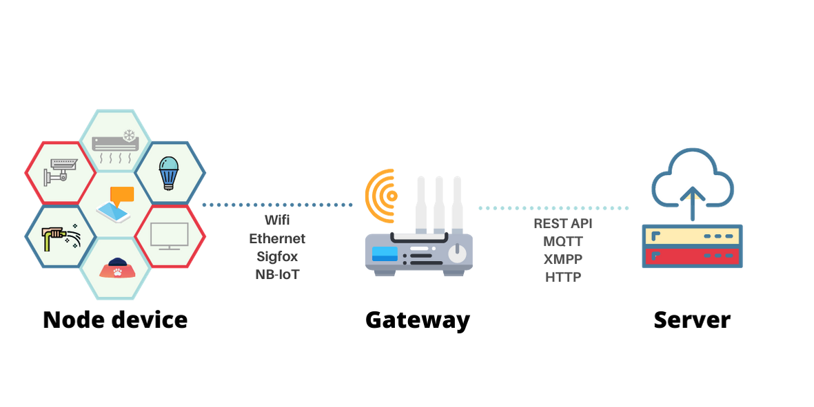
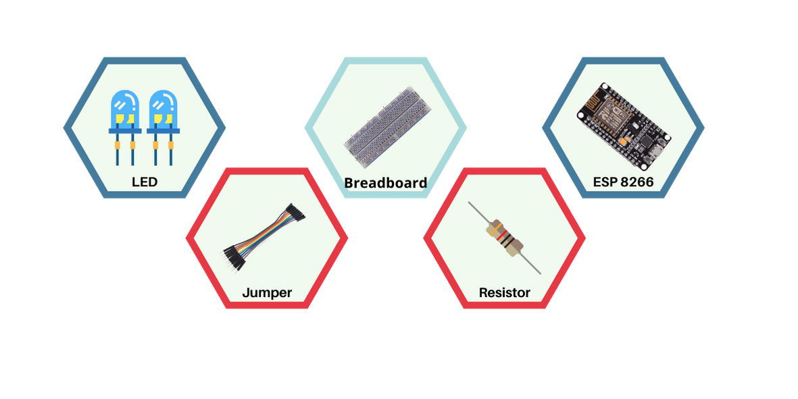

# Build Chat Bot to Control Your Home

<!-- PROJECT LOGO -->
<br />
<p align="center">
  
  <h3 align="center">ghiscure</h3>

  <p align="center">
    Simple chat bot to control your home
    <br />
    <a href="#toc"><strong>Explore the docs »</strong></a>
    <br />
    <br />
    <a href="https://m.me/ghiscure">View Demo</a>
    ·
    <a href="https://github.com/ghiscure/DevC/issues">Report Bug</a>
    ·
    <a href="https://github.com/ghiscure/DevC/issues">Request Feature</a>
  </p>
</p>

## Languange
*Read this in other languages: [English](README.en.md), [Indonesian](README.id.md).*

<a name="toc"></a>

## Table of Contents
* **[Introduction](#introduction)**
* **[Smart Home Unit and Component](#smarthome)**
* **[System Configuration](#system)**
* **[Chatbot as Control System](#chatbot)**
  - [Facebook Messenger](#messenger)
  - [Wit.ai](#wit.ai)
<!-- * **[Communication](#communication)**
  - [API](#api)
  - [MQTT](#mqtt) -->
* **[How it works](#works)**
  - [Facebook Messenger](#facebook_messenger)
  - [Wit.ai](#Wit_ai)
  - [NodeMCU](#node_mcu)
  
* **[How To Use](#howtouse)**
  - [Installation](#installation)
     - [NodeJs](#nodejs)
     - [Git](#git)
     - [Wit.ai](#install_witai)
     - [Server](#server)
     - [NodeMCU](#nodemcu)
  <!-- - [Configuration](#configuration) -->
  - [Deploy](#deploy)
      - [Heroku](#heroku)
      - [Ngrok](#ngrok)
* **[Reference](#reference)** 
* **[License](#project-license)** 
  
<!-- Introduction -->
<a name="introduction"></a>

## Introduction
These days, most people use gadget to support their activities. The development of computer and embedded devices make poeple able to control other devices with their smartphone over internet. This is called Internet of Things. The example of Internet of Things application is smart home.

In this repository we will design a smart home system that integrate with Chat bot to control electronic devices. Message from user recognized by chat bot, and that command will be forward to electronic devices. User can control their electronic devices anytime and anywhere. 


<!-- Smart Home -->
<a name="smarthome"></a>

## Smart Home Unit and Component
In IoT, there are 3 important things => node, gateaway and server. Node is the edge devices that have function to be an input or output. The example of nodes are Lamp, Air Conditioner, Pump, and Selenium Door. Gateaway is a connector between server and node. Gateaway can be a microcontroller or mini computer. 

These are components needed in this tutorial:
1. LED
2. Breadboard
3. Resistor 1K ohm
4. NodeMCU (ESP8266)
5. Jumper




<!-- System Configurantion -->
<a name="system"></a>

## System Configuration


<!-- Chatbot -->
<a name="chatbot"></a>

## Chatbot as Control System

  <a name="messenger"></a>

  ### Facebook Messenger
  Facebook Messenger is used for connecting server and user. To get started you can follow this [tutorial](https://developers.facebook.com/docs/messenger-platform/)
  
  <a name="wit.ai"></a>
  
  ### Wit.ai
  ### Build Your APP
  On this section we will show you how to build an app to control lamp.
  1. For intermezzo you can follow this [tutorial](https://wit.ai/docs/)
  2. After you create an account you can check this gif
  
  3. There are 4 important things in wit.ai
     - Utterance
     - Intent
     - Entity
     - Trait
  4. To improve the detection you need to train your app. Just add Utterance and labelling it. After that wit.ai will train your data set

<!-- <a name="communication"></a> -->

<!-- ## Communcation
  <a name="api"></a>
  
  ### API
  
  <a name="mqtt"></a>
  
  ### MQTT -->


<a name="works"></a>

## How it works

<a name="facebook_messenger"></a>

A. Facebook Messenger
1. Received text message from user and send it to wit.ai
   ```js
   if (received_message.text) {
      
      // Send text to wit.ai and get response
      var result = await getMessage(received_message.text)
      var caps= `turning ${result[0][0]} the ${result[1][0]}`

      // Send command to user
      response = {
        "text": caps
      }
      callSendAPI(sender_psid, response);


      //send result to MQTT Broker and NodeMCU
      var topic = `esp8266/ghiscure/${result[1][0]}` 
      if(result[0][0]=='on'){
      listen.publish(topic, "1");
      console.log(`${result[0][0]}, ${topic}`);
      }else{
      listen.publish(topic, "0");
      console.log(`${result[0][0]}, ${topic}`);
      }
      
    } 
   ```
2. Received voice notes from user and send it to wit.ai
   ```js
   else if (received_message.attachments[0].type=="audio") {
      console.log('audio')
      
      // Get the URL of the message attachment
      let attachment_url = received_message.attachments[0].payload.url;
      
    // Convert voice notes to mp3
     var result = await fetch(attachment_url)
     proc = new ffmpeg({source:result.body})
     proc.setFfmpegPath('ffmpeg')
     result = proc.saveToFile('output.mp3',  function(stdout, stderr){
          return "success"
     })

     // Send mp3 to wit.ai
    var mimetype_ = "audio/mpeg3"
     var readStream = fs.createReadStream("output.mp3")

     // Get Result from wit.ai
     result = await getMessagefromAudio(readStream, mimetype_)
     console.log(result)
     var caps= `turning ${result[0][0]} the ${result[1][0]}`
     response = {
      "text": caps
    }

    // send result to MQTT Broker and NodeMCU
     callSendAPI(sender_psid, response);
     if(result[0][0]=='on'){
       listen.publish(topic, "1");
       console.log(`${result[0][0]}, ${topic}`);
       }else{
       listen.publish(topic, "0");
       console.log(`${result[0][0]}, ${topic}`);
       }     
    }
   ```
<a name="wit_ai"></a>

B. Wit.ai

1. Get Message from text parameter
```js
    // This function is used to get response from wit.ai. This function requires a string parameter
      getMessage: async function(query){
    var url =`https://api.wit.ai/message?v=20201020&q=${encodeURI(query)}` 

    var response = await fetch(url, {
        headers: {
            'Authorization': 'Your Api Token'
        }
    })
    var json_data = await response.json()
    try {

      // Get Command Value
      var cmd_value =json_data.traits.wit$on_off[0].value
      var cmd_confidence = json_data.traits.wit$on_off[0].confidence

      // Get Object Value
      var object_value = json_data.entities['object:object'][0].value
      var object_confidence = json_data.entities['object:object'][0].confidence

      return [[cmd_value,cmd_confidence],[object_value,object_confidence]]   

    } catch (error) {
      console.log(error)
      
    }
    
  }
```

2. Get Message from voice notes
```js
    // This function is used to get response from wit.ai. This function requires an audio file as parameter
      getMessagefromAudio: async function(bin_data, mimetype_){
    var options = {
        method: 'POST',
        headers: {
            'Authorization': process.env.witai_token,
            'Content-Type': mimetype_
        },
        encoding: null,
        body: bin_data
      }
    var url =`https://api.wit.ai/speech?v=20200513` 
    try {
        // Get response from wit.ai
      var response = await fetch(url, options)
      var json_data = await response.json()
      
      // Get Command Value
      var cmd_value =json_data.traits.wit$on_off[0].value
      var cmd_confidence = json_data.traits.wit$on_off[0].confidence

      // Get Object Value
      var object_value = json_data.entities['object:object'][0].value
      var object_confidence = json_data.entities['object:object'][0].confidence

      console.log(cmd_value, cmd_confidence)
      console.log(object_value, object_confidence)  
      return [[cmd_value,cmd_confidence],[object_value,object_confidence]]     
    } catch (error) {
      console.log(error)
      
    }
  }
```

<a name="node_mcu"></a>

C. NodeMCU
1. Received data from MQTT Broker and Turn on/off the lamp/AC
```c

// If a message is received on the topic esp8266/ghiscure/AC, check if the message is either 1 or 0. Turns the ESP GPIO according to the message

  if(topic=="esp8266/ghiscure/AC"){
      Serial.print("Changing GPIO 4 to ");
      if(messageTemp == "1"){
        digitalWrite(ledGPIO4, HIGH); //Turn on AC
        Serial.print("On");
      }
      else if(messageTemp == "0"){
        digitalWrite(ledGPIO4, LOW); //Turn off AC
        Serial.print("Off");
      }
  }
    // If a message is received on the topic esp8266/ghiscure/lamp, check if the message is either 1 or 0. Turns the ESP GPIO according to the message

  if(topic=="esp8266/ghiscure/lamp"){
      Serial.print("Changing GPIO 5 to ");
      if(messageTemp == "1"){
        digitalWrite(ledGPIO5, HIGH); // turn on lamp
        Serial.print("On");
      }
      else if(messageTemp == "0"){
        digitalWrite(ledGPIO5, LOW); //turn off lamp
        Serial.print("Off");
      }
  }
```

2. Subscribe topic
```c
// You need to add subscribe function to get message from spesific topic
client.subscribe("esp8266/ghiscure/AC");
client.subscribe("esp8266/ghiscure/lamp");
```

<a name="howtouse"></a>

## How to Use


<a name="installation"></a>

### Installation

<a name="git"></a>

A.  Git
1. Start by updating the package index
```bash
sudo apt update
```
2. Run the following command to install Git:
```bash
sudo apt install git
```
3. Verify the installation by typing the following command which will print the Git version:
```bash
git --version
```
4. Windows Installations
```
https://git-scm.com/download/win
```

<a name="nodejs"></a>

B.  NodeJs
1. Debian Based
```sh
# Using Ubuntu
curl -sL https://deb.nodesource.com/setup_lts.x | sudo -E bash -
sudo apt-get install -y nodejs

# Using Debian, as root
curl -sL https://deb.nodesource.com/setup_lts.x | bash -
apt-get install -y nodejs
```
2. Windows
```
https://nodejs.org/en/download/
```

<a name="install_witai"></a>

C. Wit.ai
1. To get wit.ai token you can follow this [tutorial](https://wit.ai/docs/quickstart).
```
https://wit.ai/docs/quickstart
```

<a name="server"></a>

D.  Server
#### Prerequisite
1. Before you use this app, you must register your app in facebook platform. You can follow this [tutorial](https://developers.facebook.com/docs/messenger-platform/getting-started-app-setup) to get PAGE_ACCESS_TOKEN.
```
https://developers.facebook.com/docs/messenger-platform/getting-started-app-setup
```
There are 4 items that you must pay attention to


2. For VERIFY_TOKEN, it is up to you
3. You must have [Wit.ai Token](#install_witai)
4. After you have PAGE_ACCESS_TOKEN,VERIFY_TOKE  and Wit.ai Token, just follow this step
```bash
git clone https://github.com/ghiscure/DevC
cd DevC
mv .env.example .env
#Edit .env with your app credentials
npm install
npm start
```
5. Server configuration is done

<a name="nodemcu"></a>

E.  NodeMCU

Because of limited devices, in this demonstration we will use LED. This led can represent AC, Pump or another electronic devices.
1. Install [Arduino](https://www.arduino.cc/en/main/software)
```
https://www.arduino.cc/en/main/software
```
2. Install [NodeMCU board](https://randomnerdtutorials.com/how-to-install-esp8266-board-arduino-ide/) in Arduino
```
https://randomnerdtutorials.com/how-to-install-esp8266-board-arduino-ide/
```
3. Wiring Schematic

4. Edit config of wireless connection
```c
// Change the credentials below, so your ESP8266 connects to your router
const char* ssid = ""; // your ssid name
const char* password = ""; // password ssid
```
5. Upload file to NodeMCU


### Deploy
1. Heroku
   1. You can use this [tutorial](https://devcenter.heroku.com/articles/deploying-nodejs) to deploy app
   ```
   https://devcenter.heroku.com/articles/deploying-nodejs
   ```
   2. You must edit the environment variable. You can use this [tutorial](https://devcenter.heroku.com/articles/config-vars) to edit the env variable. 
   ```
   https://devcenter.heroku.com/articles/config-vars
   ```
   3. There are 3 environment variable that you must set in config vars.
      *  PAGE_ACCESS_TOKEN
      *  VERIFY_TOKEN
      *  witai_token
   4. Change your Facebook callback URL to heroku
2. Ngrok <br>
   You can use ngrok for forwarding http protocol. Follow this [tutorial](https://ngrok.com/docs) to forward your localhost to public. Change your Facebook's URL callback to ngrok url.
   ```bash
   ngrok http 3000
   ```


<a name="reference"></a>

## Reference

1. [ESP32 MQTT – Publish and Subscribe with Arduino IDE](https://randomnerdtutorials.com/esp32-mqtt-publish-subscribe-arduino-ide/)
2. [Getting Started with Messenger Platfrom](https://developers.facebook.com/docs/messenger-platform/)
3. [Build Your First Wit App](https://wit.ai/docs/quickstart)
4. [Getting Started on Heroku with Node.js](https://devcenter.heroku.com/articles/deploying-nodejs)
5. [Configuration and Config Vars](https://devcenter.heroku.com/articles/config-vars)
6. [Expose a local web server to the internet](https://ngrok.com/docs)

<a name="project-license"></a>

## License
Usage is provided under the [MIT License](http://opensource.org/licenses/mit-license.php). See LICENSE for the full details.
