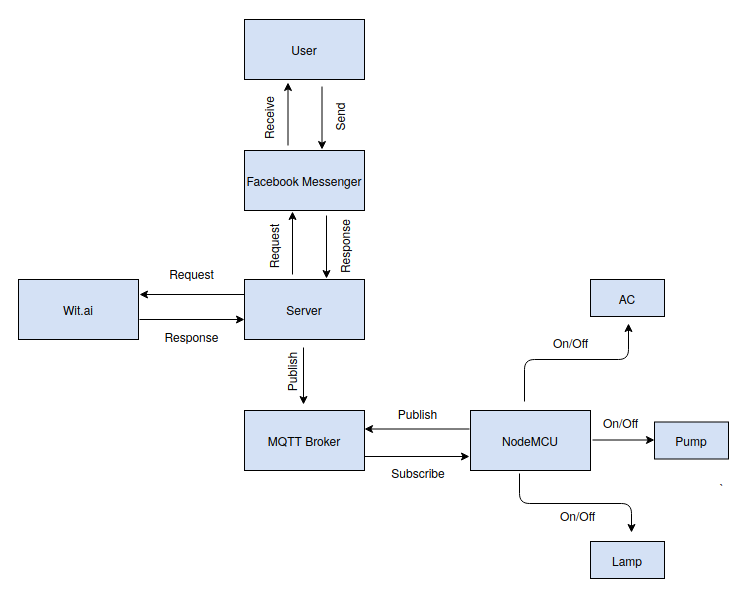
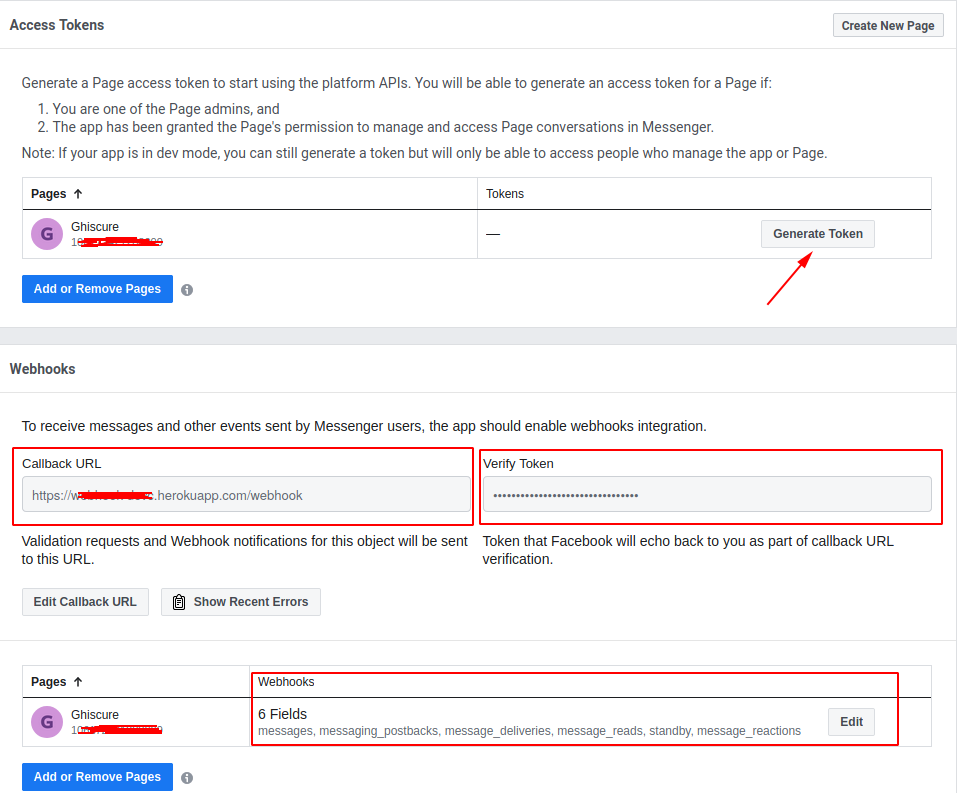
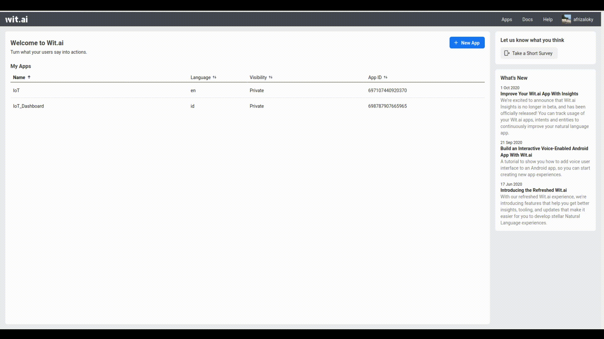
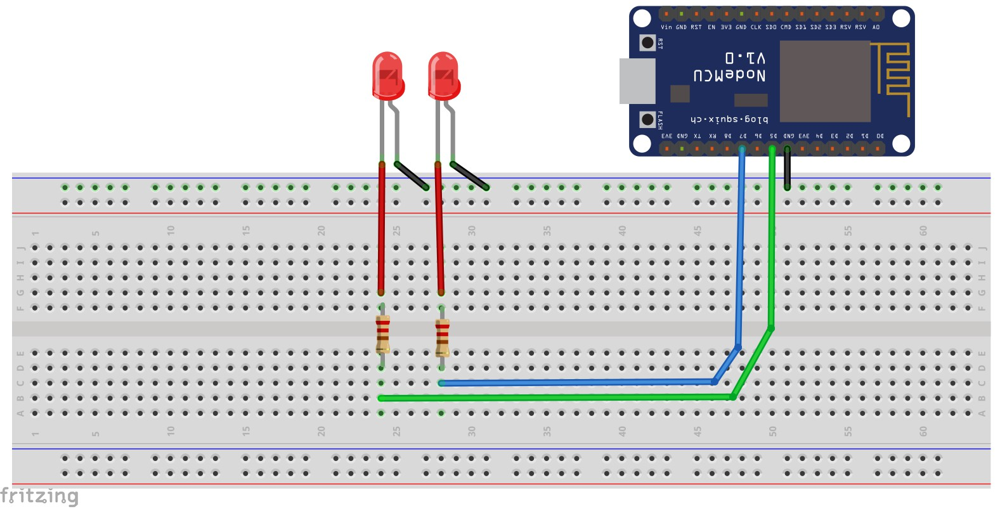
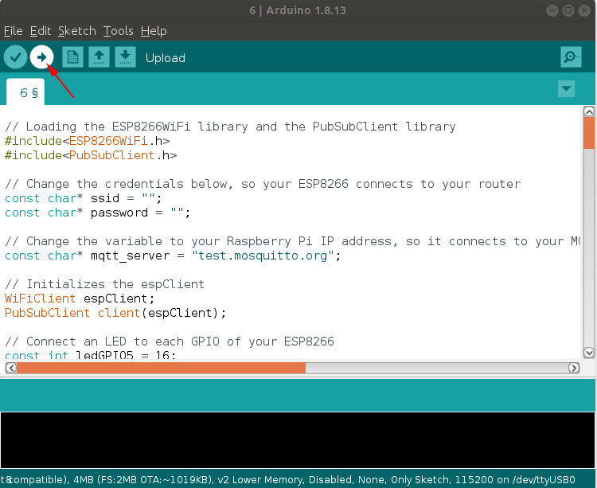

# Membuat Bot Percakapan Untuk Mengatur Rumah Anda

<!-- PROJECT LOGO -->
<br />
<p align="center">
  
  <h3 align="center">ghiscure</h3>

  <p align="center">
    bot percakapan simpel untuk mengatur rumah anda
    <br />
    <a href="#toc"><strong>Jelajahi dokumentasi »</strong></a>
    <br />
    <br />
    <a href="https://m.me/ghiscure">Lihat Demo</a>
    ·
    <a href="https://github.com/ghiscure/DevC/issues">Laporkan gangguan</a>
    ·
    <a href="https://github.com/ghiscure/DevC/issues">Ajukan Fitur</a>
  </p>
</p>

## Languange
*Baca ini dalam bahasa lain: [Inggris](README.md), [Indonesia](README.id.md).*

<a name="toc"></a>

## Daftar Isi
* **[Pengenalan](#introduction)**
* **[<em>Smart Home</em> dan komponennya](#smarthome)**
* **[Konfigurasi sistem](#system)**
* **[Bot percakapan sebagai sistem kontrol](#chatbot)**
  - [Facebook Messenger](#messenger)
  - [Wit.ai](#wit.ai)
* **[Komunikasi](#communication)**
  - [API](#api)
  - [MQTT](#mqtt)
* **[Bagaimana sistem ini bekerja](#works)**
  - [Facebook Messenger](#facebook_messenger)
  - [Wit.ai](#Wit_ai)
  - [NodeMCU](#node_mcu)
  
* **[Cara penggunaan](#howtouse)**
  - [Instalasi](#installation)
     - [NodeJs](#nodejs)
     - [Git](#git)
     - [Wit.ai](#instalasi_witai)
     - [Server](#server)
     - [NodeMCU](#nodemcu)
  <!-- - [Configuration](#configuration) -->
  - [Deploy](#deploy)
      - [Heroku](#heroku)
      - [Ngrok](#ngrok)
* **[Lisensi](#project-license)** 
  
<!-- Pengenalan -->
<a name="introduction"></a>
## Pengenalan


<!-- rumah cerdas -->
<a name="smarthome"></a>
## <emp>Smart Home</emp> dan komponennya


<!-- Konfigurasi Sistem -->
<a name="system"></a>
## Konfigurasi Sistem



<!-- Bot Percakapan -->
<a name="chatbot"></a>
## Bot percakapan sebagai sistem kontrol

  <a name="messenger"></a>

  ### Facebook Messenger
  Facebook messenger digunakan untuk menerima pesan dari user. Pesan tersebut dapat berupa pesan suara maupun pesan teks. Untuk pembuatan messenger anda dapat mengikuti panduan berikut
  1. Membuat akun [facebook](https://facebook.com)
  2. Membuat [pages](https://www.facebook.com/pages/create) facebook 
  3. Membuat applikasi pada [<em>Dashboard Facebook</em>](https://developers.facebook.com/apps/)
  4. Ada 4 hal yang harus anda perhatikan
   
      <a name="page_access_token"></a>
      - Generate Token. Token tersebut akan digunakan untuk konfigurasi pada server
      <a name="callback_url"></a>
      - Callback URL. URL tersebut akan digunakan untuk konfigurasi pada server
      <a name="verify_token"></a>
      - Verify Token. Verify Token dapat diisi sesuka hati anda. Verify token nantinya akan digunakan untuk konfigurasi server
      - Ijinkan layanan messages untuk dapat menggunakannya.

  
  <a name="wit.ai"></a>
  
  ### Wit.ai
  ### Buat aplikasimu
  Pada bagian ini saya akan menunjukkan bagaimana cara membuat aplikasi untuk mengontrol lampu. Berikut panduannya:
  1. Mendaftarkan akun
   
      Pengguna hanya dapat mendaftarkan akun baru dengan menggunakan akun facebook. Jika belum memiliki akun facebook, silahkan buat akun terlebih dahulu. Kunjungi laman [wit.ai](https://wit.ai) dan buat akun baru dengan memilih “Continue with facebook”.
  2. Buat aplikasi wit baru

      Untuk membuat aplikasi wit baru, klik tombol “New App” yang ada di bagian atas halaman awal akun anda. Kemudian isi nama aplikasi serta bahasa yang nantinya akan digunakan oleh aplikasi. Jika sudah, tekan tombol “Create”, maka anda akan dibawa ke halaman aplikasi baru anda yang juga merupakan halaman “understanding” dari aplikasi.
  3. Latih aplikasi milik anda
   
      Aplikasi wit ini nantinya akan membantu untuk memahami instruksi yang diberikan user pada aplikasi melalui chatting. wit bekerja dengan cara menerima dan memahami masukan dari user yang berupa kata atau kalimat (utterance), kemudian wit akan berusaha memahaminya untuk kemudian memberikan sebuah keluaran berupa respon yang paling sesuai dengan keinginan pengguna berdasarkan masukan tadi. 

      

      Agar wit dapat memahami masukan dari user, anda perlu melatih aplikasi yang barusan anda buat. Cara melatihnya adalah dengan memberikan wit beberapa ujaran beserta intent yang diinginkan dari ujaran-ujaran tersebut. Masukkan ujaran pada kolom “utterance” kemudian pilih atau buat respon pada pilihan “intent”. Misalkan anda memasukkan “tolong nyalakan lampu?” sebagai ujaran dan “perintah” sebagai “intent”, lampu sebagai “entity object” dan “wit/on_off” sebagai “trait”. setelah selesai, pilih “Train and Validate” untuk menjadwalkan aplikasi anda untuk berlatih berdasarkan ujaran dan kehendak yang anda masukkan tadi. setelah aplikasi sudah selesai dilatih, maka aplikasi nantinya dapat memahami ujaran dari user dan memberikan kehendak yang sesuai.
  4. Tingkat kualitas pengenalan kata
  
      Untuk meningkatkan kualitas deteksi dari aplikasi, anda bisa memberikan beberapa versi ujaran untuk kehendak yang sama. dengan begitu aplikasi wit akan semakin mudah dalam mengenali ujaran-ujaran berbeda yang diberikan oleh pengguna dan memberikan kehendak yang sesuai.
  5. Lakukan query pada applikasi
  
      Setelah melatih aplikasi wit, anda bisa memulai untuk melakukan query terhadap aplikasi melalui wit.ai API. Untuk melakukannya masuk ke setting aplikasi melalui menu management yang ada di sebelah kiri halaman aplikasi anda. masukan contoh ujaran pada kolom HTTP API yang nantinya anda akan diberikan sebuah cURL yang dapat anda buka di terminal. cURL tersebut nantinya akan memberikan hasil dari aplikasi wit terkait ujaran yang anda berikan sebelumnya. hasil yang diberikan adalah sebuah JSON file yang berisi hal-hal berikut:

      * Text
      * Intents
      * Entity
      * Traits

  6. Lengkapi intent

      Setelah mencoba query dan anda menemukan beberapa kehendak yang tidak sesuai dengan ujaran yang diberikan, anda dapat kembali ke bagian awal atau understanding dengan menekan bagian “understanding” yang ada di sebelah kiri halaman. di halaman understanding anda akan menemukan query yang anda masukkan tadi. anda dapat mencari query mana yang kehendaknya tidak sesuai dan memberikannya kehendak yang baru yang lebih sesuai.
  7. Buat entitas
  
      Pada file JSON yang anda dapatkan sebelumnya anda mendapatkan pula sebuah “entities” yang sebelumnya masih kosong. Anda bisa mulai untuk memberikan entitas kepada setiap ujaran yang anda miliki untuk melatih aplikasi wit lebih jauh lagi. pilih ujaran yang diinginkan, highlight atau blok bagian dari ujaran yang nantinya berperan penting pada kehendak yang dikeluarkan, misalnya nilai suhu pada ujaran untuk mengubah suhu ac, atau kata mati/nyala pada ujaran mematikan/menyalakan lampu. nantinya akan muncul sebuah dropdown berisi entities. anda dapat membuat sendiri entitasnya atau menggunakan entitas yang sudah disediakan oleh wit. setelah memilih entitas, klik “Train and Validate” untuk melatih aplikasi agar nantinya juga dapat memberikan entitas dalam keluarannya.


<!-- <a name="communication"></a>

## Communcation
  <a name="api"></a>
  
  ### API
  
  <a name="mqtt"></a>
  
  ### MQTT -->


<a name="works"></a>

## Bagaimana Ini Bekerja

<a name="facebook_messenger"></a>

A. Facebook Messenger
1. Menerima teks pesan dari pengguna dan mengirimkannya ke wit.ai
   ```js
   if (received_message.text) {
      
      // Mengirimkan teks ke wit.ai dan mendapatkan respon
      var result = await getMessage(received_message.text)
      var caps= `turning ${result[0][0]} the ${result[1][0]}`

      // Kirimkan perintah kepada user
      response = {
        "text": caps
      }
      callSendAPI(sender_psid, response);


      //kirim hasil ke broker MQTT dan NodeMCU
      var topic = `esp8266/ghiscure/${result[1][0]}` 
      if(result[0][0]=='on'){
      listen.publish(topic, "1");
      console.log(`${result[0][0]}, ${topic}`);
      }else{
      listen.publish(topic, "0");
      console.log(`${result[0][0]}, ${topic}`);
      }
      
    } 
   ```
2. Menerima pesan suara dari pengguna dan mengirimkannya ke wit.ai
   ```js
   else if (received_message.attachments[0].type=="audio") {
      console.log('audio')
      
      // Dapatkan URL dari lampiran pesan
      let attachment_url = received_message.attachments[0].payload.url;
      
    // konversi pesan suara ke mp3
     var result = await fetch(attachment_url)
     proc = new ffmpeg({source:result.body})
     proc.setFfmpegPath('ffmpeg')
     result = proc.saveToFile('output.mp3',  function(stdout, stderr){
          return "success"
     })

     // Kirim mp3 ke wit.ai
    var mimetype_ = "audio/mpeg3"
     var readStream = fs.createReadStream("output.mp3")

     // Dapatkan hasil dari wit.ai
     result = await getMessagefromAudio(readStream, mimetype_)
     console.log(result)
     var caps= `turning ${result[0][0]} the ${result[1][0]}`
     response = {
      "text": caps
    }

    // Kirimkan hasil ke broker MTQQ dan NodeMCU
     callSendAPI(sender_psid, response);
     if(result[0][0]=='on'){
       listen.publish(topic, "1");
       console.log(`${result[0][0]}, ${topic}`);
       }else{
       listen.publish(topic, "0");
       console.log(`${result[0][0]}, ${topic}`);
       }     
    }
   ```
<a name="wit_ai"></a>

B. Wit.ai

1. Dapatkan pesan dari parameter text
```js
    // fungsi ini digunakan untuk mendapatkan respon dari wit.ai. fungsi ini membutuhkan string sebagai parameternya
      getMessage: async function(query){
    var url =`https://api.wit.ai/message?v=20201020&q=${encodeURI(query)}` 

    var response = await fetch(url, {
        headers: {
            'Authorization': 'Your Api Token'
        }
    })
    var json_data = await response.json()
    try {

      // Dapatkan nilai perintah
      var cmd_value =json_data.traits.wit$on_off[0].value
      var cmd_confidence = json_data.traits.wit$on_off[0].confidence

      // Dapatkan nilai objek
      var object_value = json_data.entities['object:object'][0].value
      var object_confidence = json_data.entities['object:object'][0].confidence

      return [[cmd_value,cmd_confidence],[object_value,object_confidence]]   

    } catch (error) {
      console.log(error)
      
    }
    
  }
```
  
2. Dapatkan pesan dari pesan suara
```js
    // Fungsi ini digunakan untuk mendapatkan respon dari wit.ai. fungsi ini membutuhkan string sebagai parameternya
      getMessagefromAudio: async function(bin_data, mimetype_){
    var options = {
        method: 'POST',
        headers: {
            'Authorization': process.env.witai_token,
            'Content-Type': mimetype_
        },
        encoding: null,
        body: bin_data
      }
    var url =`https://api.wit.ai/speech?v=20200513` 
    try {
        // Dapatkan respon dari wit.ai
      var response = await fetch(url, options)
      var json_data = await response.json()
      
      // Dapatkan nilai perintah
      var cmd_value =json_data.traits.wit$on_off[0].value
      var cmd_confidence = json_data.traits.wit$on_off[0].confidence

      // Dapatkan nilai objek
      var object_value = json_data.entities['object:object'][0].value
      var object_confidence = json_data.entities['object:object'][0].confidence

      console.log(cmd_value, cmd_confidence)
      console.log(object_value, object_confidence)  
      return [[cmd_value,cmd_confidence],[object_value,object_confidence]]     
    } catch (error) {
      console.log(error)
      
    }
  }
```

<a name="node_mcu"></a>

C. NodeMCU
1. Terima data dari broker MTQQ dan menyalakan/mematikan lampu
```c

// Jika pesan diterima di topik esp8266/ghiscure/AC, silahkan anda cek apakah pesannya bernilai 1 atau 0. ubah ESP GPIO menurut pesan yang diterima

  if(topic=="esp8266/ghiscure/AC"){
      Serial.print("Changing GPIO 4 to ");
      if(messageTemp == "1"){
        digitalWrite(ledGPIO4, HIGH); //Nyalakan AC
        Serial.print("On");
      }
      else if(messageTemp == "0"){
        digitalWrite(ledGPIO4, LOW); //Matikan AC
        Serial.print("Off");
      }
  }
// Jika pesan diterima pada topik esp8266/ghiscure/lamp, silahkan cek apakah pesannya bernilai 1 atau 0. Ubah ESP GPIO menurut pesan yang diterima

  if(topic=="esp8266/ghiscure/lamp"){
      Serial.print("Changing GPIO 5 to ");
      if(messageTemp == "1"){
        digitalWrite(ledGPIO5, HIGH); // nyalakan lampu
        Serial.print("On");
      }
      else if(messageTemp == "0"){
        digitalWrite(ledGPIO5, LOW); //matikan lampu
        Serial.print("Off");
      }
  }
```

2. <em>Subscribe</em> Topik
```c
// Anda perlu menambahkan fungsi langganan untuk mendapatkan pesan dari topik tertentu
client.subscribe("esp8266/ghiscure/AC");
client.subscribe("esp8266/ghiscure/lamp");
```

<a name="howtouse"></a>

## Cara Penggunaan


<a name="installation"></a>

### Instalasi

<a name="git"></a>

A.  Git
1. Mulai dengan memperbarui package
```bash
sudo apt update
```
2. Jalankan perintah di bawah untuk memasang Git:
```bash
sudo apt install git
```
3. verifikasi pemasangan dengan menulis perintah berikut yang akan menuliskan versi dari Git:
```bash
git --version
```
4. Pemasangan pada Windows
```
https://git-scm.com/download/win
```
<a name="nodejs"></a>

B.  NodeJs
1. Berbasis Debian
```sh
# Menggunakan Ubuntu
curl -sL https://deb.nodesource.com/setup_lts.x | sudo -E bash -
sudo apt-get install -y nodejs

# Menggunakan Debian, sebagai root
curl -sL https://deb.nodesource.com/setup_lts.x | bash -
apt-get install -y nodejs
```
2. Windows
```
https://nodejs.org/en/download/
```

<a name="server"></a>

C.  Server
#### Prasyarat
* Mempunyai [PAGE_ACCESS_TOKEN](#page_access_token).
* Mempunyai [Wit.ai_Token](#witai_token)

Ikuti panduan berikut untuk menjalankan server: 
```bash
git clone https://github.com/ghiscure/DevC
cd DevC
mv .env.example .env
# Ubah .env dengan kredensial aplikasi anda
npm install
npm start
```
<a name="nodemcu"></a>

D.  NodeMCU

1. Pasang Aplikasi [Arduino](https://www.arduino.cc/en/main/software)
```
https://www.arduino.cc/en/main/software
```
2. Pasang [<em>Board</em> NodeMCU](https://randomnerdtutorials.com/how-to-install-esp8266-board-arduino-ide/) di Arduino
```
https://randomnerdtutorials.com/how-to-install-esp8266-board-arduino-ide/
```
1. Skema Pemasangan

4. Ubah konfigurasi username dan password yang anda punya
```c
// ubah kredensial di bawah agar ESP8266 milik anda dapat terkoneksi ke router 
const char* ssid = ""; // nama ssid anda
const char* password = ""; // password ssid
```
5. Unggah berkas ke NodeMCU



### Deploy
1. Heroku
   1. Anda bisa gunakan [panduan](https://devcenter.heroku.com/articles/deploying-nodejs) ini untuk men-deploy aplikasi
   ```
   https://devcenter.heroku.com/articles/deploying-nodejs
   ```
   1. Anda harus mengubah environment variable. Anda bisa gunakan [panduan](https://devcenter.heroku.com/articles/config-vars) ini untuk mengedit variable env. 
   ```
   https://devcenter.heroku.com/articles/config-vars
   ```
   1. Terdapat 3 environment variable yang harus diatur dalam config vars.
      *  PAGE_ACCESS_TOKEN
      *  VERIFY_TOKEN
      *  witai_token
   2. Ubah URL callback Facebook anda ke url dari heroku
2. Ngrok <br>
   Anda bisa gunakan Ngrok untuk melakukan penerusan/forwarding protokol HTTP. Ikuti [panduan](https://ngrok.com/docs) di bawah ini untuk <em>forward</em> localhost anda ke publik. Ubah URL callback facebook anda ke URL dari ngrok.
   ```
   https://ngrok.com/docs
   ```


<a name="Referensi"></a>

## Referensi

1. [ESP32 MQTT – Publish and Subscribe with Arduino IDE](https://randomnerdtutorials.com/esp32-mqtt-publish-subscribe-arduino-ide/)
2. [Getting Started with Messenger Platfrom](https://developers.facebook.com/docs/messenger-platform/)
3. [Build Your First Wit App](https://wit.ai/docs/quickstart)
4. [Getting Started on Heroku with Node.js](https://devcenter.heroku.com/articles/deploying-nodejs)
5. [Configuration and Config Vars](https://devcenter.heroku.com/articles/config-vars)
6. [Expose a local web server to the internet](https://ngrok.com/docs)

<a name="project-license"></a>

## License
Penggunaan disediakan di bawah [Lisensi MIT](http://opensource.org/licenses/mit-license.php). Lihat LISENSI untuk detail lengkap.